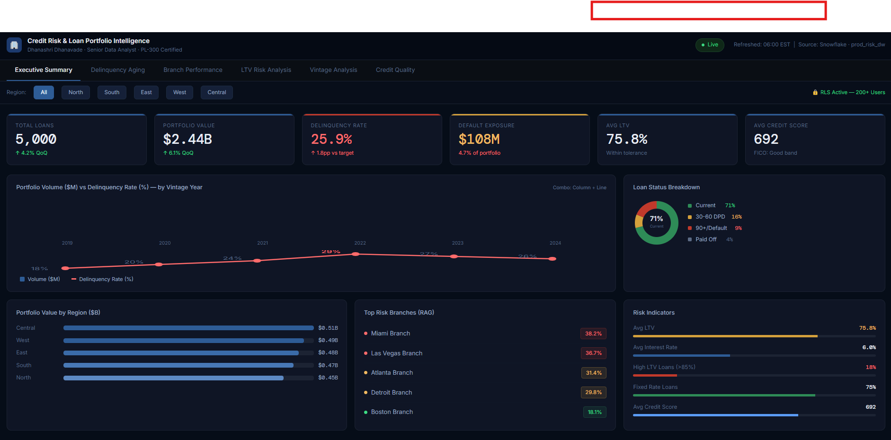
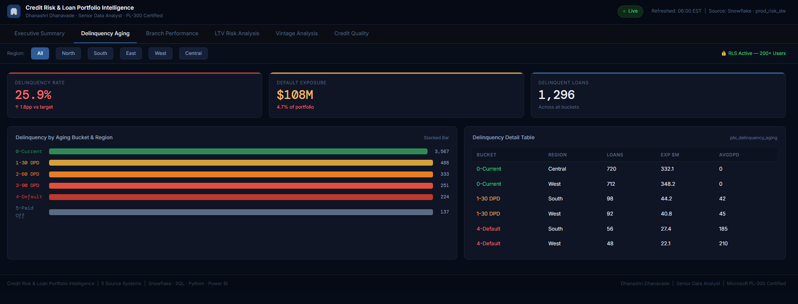
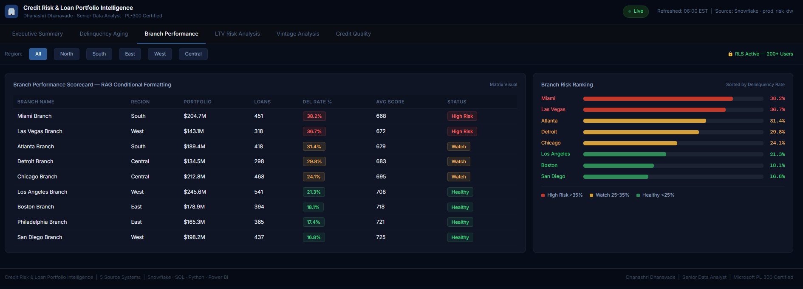
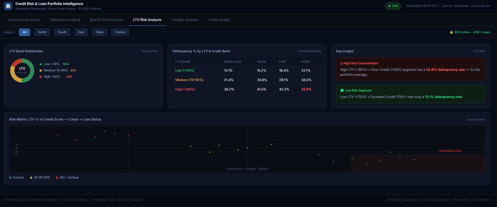
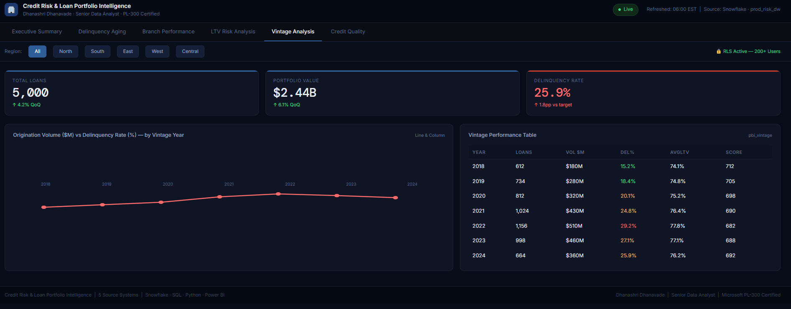
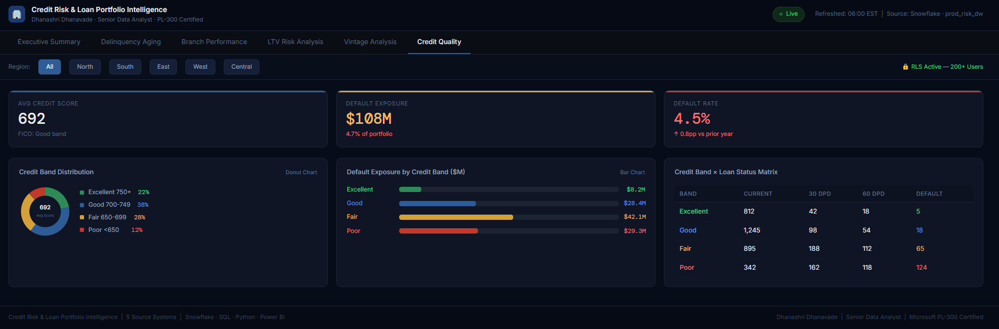

# 🏦 Credit Risk & Loan Portfolio Intelligence Platform
> **Banking Analytics | Power BI · SQL · Python · Snowflake**
> 
> *Built by Dhanashri Dhanavade | Senior Data Analyst | Microsoft PL-300 Certified*

---

## 📊 Dashboard Screenshots

### Page 1 — Executive Summary


### Page 2 — Delinquency Aging Analysis


### Page 3 — Branch Performance Scorecard


### Page 4 — LTV Risk Analysis


### Page 5 — Vintage Analysis


### Page 6 — Credit Quality


---

## 🎯 Business Problem

A bank's risk committee had **no real-time view** of their $2.4B loan portfolio. Delinquency rates, LTV exposure, and branch-level risk were tracked in **disconnected Excel files** — leadership was always reacting, never anticipating risk.

> *"Which regions, branches and loan segments are at risk right now — and how much capital are we exposed to?"*

---

## 💡 Solution Architecture

```
5 Source Systems → SQL JOINs → Python EDA → Power BI Dashboard (6 pages)

dim_branch_master.csv        → Branch / HR System
fact_loan_originations.csv   → Loan Origination System
fact_loan_servicing.csv      → Collections System
fact_credit_bureau.csv       → Credit Bureau
fact_property_collateral.csv → Property / Appraisal System
```

---

## 📈 Business Impact

| Metric | Result |
|--------|--------|
| Default exposure surfaced | **$108M** |
| Reporting time reduction | **65% faster** |
| Active dashboard users | **200+ with RLS** |
| Source systems unified | **5 → 1 view** |
| Portfolio covered | **$2.44 Billion** |

---

## 🔑 Key Findings

- High-LTV (>85%) + Poor Credit (<650) segment has **52.8% delinquency rate** — 3x the portfolio average
- Miami Branch (38.2%) and Las Vegas Branch (36.7%) flagged as **High Risk**
- 2022 vintage loans showing highest delinquency at **29.2%**
- **$108M default exposure** surfaced for the first time in one view

---

## 🛠️ Tech Stack

| Tool | Purpose |
|------|---------|
| Power BI Desktop | 6-page executive dashboard |
| DAX | Calculated measures & KPIs |
| Row-Level Security | Regional access control (200+ users) |
| SQL (SQLite) | Data warehouse & JOIN queries |
| Snowflake | Cloud data warehouse (production) |
| Python (pandas) | EDA, risk scoring, data preparation |
| Matplotlib / Seaborn | Analysis charts |
| Jupyter Notebook | End-to-end analysis pipeline |

---

## 🗄️ Core SQL Query — 5 System JOIN

```sql
SELECT
    lo.LoanID, lo.LoanType, lo.LoanAmount, lo.InterestRate,
    br.BranchName, br.Region, br.State,
    sv.LoanStatus, sv.DaysDelinquent, sv.AgingBucket,
    cb.CreditScore, cb.CreditBand,
    pc.PropertyValue, pc.LTV, pc.LTV_Band,
    ROUND(sv.MonthlyPayment / cb.MonthlyIncome, 3) AS DTI_Ratio
FROM fact_loan_originations   lo
JOIN dim_branch_master         br ON lo.BranchID = br.BranchID
JOIN fact_loan_servicing       sv ON lo.LoanID   = sv.LoanID
JOIN fact_credit_bureau        cb ON lo.LoanID   = cb.LoanID
JOIN fact_property_collateral  pc ON lo.LoanID   = pc.LoanID
```

---

## 📊 Key DAX Measures

```dax
Delinquency Rate =
ROUND(DIVIDE(
    COUNTROWS(FILTER('pbi_master_loans',
        'pbi_master_loans'[LoanStatus] <> "Current" &&
        'pbi_master_loans'[LoanStatus] <> "Paid Off")),
    COUNTROWS('pbi_master_loans')) * 100, 1)

Default Exposure $M =
ROUND(CALCULATE(SUM('pbi_master_loans'[LoanAmount]),
    'pbi_master_loans'[LoanStatus] = "Default") / 1000000, 1)
```

---

## 📁 Files

```
├── Project1_CreditRisk_Analysis.ipynb  ← SQL + Python notebook
├── Credit_Risk_Dashboard.html          ← Interactive web demo
├── screenshots/                        ← All 6 dashboard pages
└── data/                               ← 5 source CSV files
```

---

## 👩‍💼 About

**Dhanashri Dhanavade** | Senior Data Analyst & BI Consultant

- 📧 dhanashridh1@gmail.com
- 🏅 Microsoft PL-300 Power BI Data Analyst Certified
- 🏅 Microsoft DP-900 Azure Data Fundamentals Certified
- 🏦 Senior BI Consultant @ Flagstar Bank

---
*⭐ Star this repo if you found it useful!*
